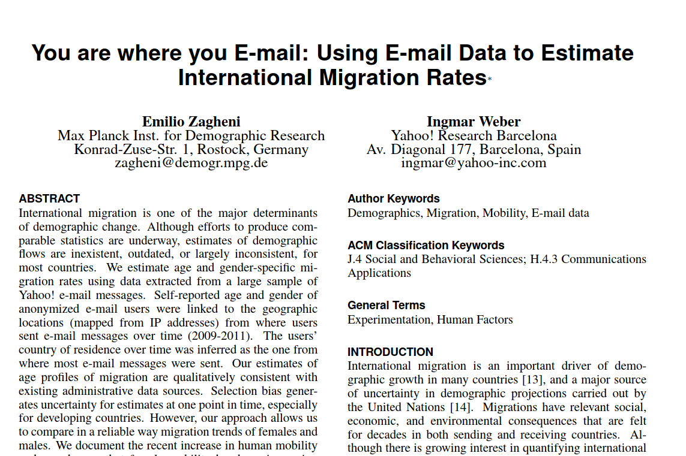
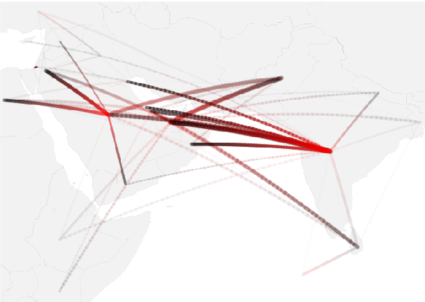
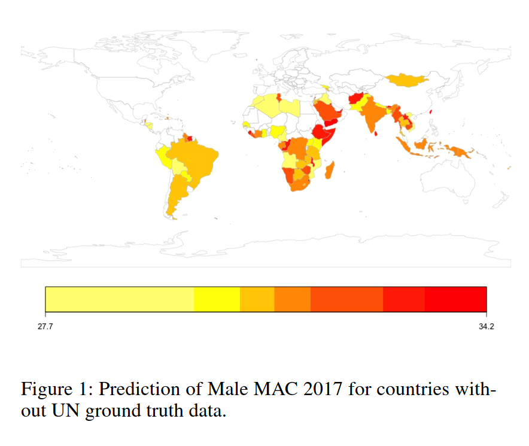

```{r setup, include=FALSE}
knitr::opts_chunk$set(echo = FALSE)
options(tinytex.verbose = TRUE)
```

## Agenda

1. Course setup and final assignment
1. Introduction to digital demography
1. Data and approaches
1. Current topics


## Hello from the Lab of Digital and Computational Demography!

{width=300px}

\tiny https://www.demogr.mpg.de/en/research_6120/digital_and_computational_demography_5555

# Course setup

## Week's schedule

- Monday 11:30-13.00 - “Introduction to digital demography”
- Tuesday 11:30-13.00 - “Crowd-sourced online data” 
- Wednesday 11:30-13.00 -  “Digital trace data”
- Thursday 11:30-13.00  - “Computational approaches”
- Friday - No class

## Technical setup

- Online lectures 
   + Add me in Skype: diego.alburez
   + Online office hours
- Course materials (syllabus, presentations, readings, assignment)
   + https://github.com/alburezg/EDSD20_digital_demography
   + Download complete repository
- Requirements
   + Running installation of RStudio
   + packages: 'tidyverse', 'data.table', 'knitr', 'rmarkdown'
   + Miktex, Texlive or RStudio's 'tinytex'

## Final assignment

**Goal**

- Hands-on experience using crowd-sourced digital data. 
- Sample of Familinx database: user-generated genealogical records  

**Exercises**

1. Compute: historical lifespan in Sweden
1. Discuss: lifespan and life expectancy
1. Evaluate: bias in the online genealogies

*See full instructions in syllabus!*


## Evaluation

Assignments due Friday April 3 at midnight (CET): 

1. A written Rmarkdown report (Word document of pdf file). 
1. Include R code as inline chunks
1. Introduction to Rmarkdown: https://rmarkdown.rstudio.com/lesson-1.html

*See full instructions in syllabus!*


# Introduction to Digital Demography

## What is 'digital' demography?

- Digital vs analogue
- Online vs offline
- 'Big' vs 'small' data

{width=375px}

## Digital data sources for demographic research


1. Crowd-sourced online data 
1. Digital Trace Data (online and offline)
1. Simulations (made-up data)


## 'Big data' is not new data

{width=250px}

\tiny https://commons.wikimedia.org/wiki/File:Volkstelling_1925_Census.jpg   


## Pioneering work


{width=350px}

\tiny Zagheni, E. and Weber, I. (2012). You are where you e-mail: Using e-mail data to estimate international migration rates. 3rd Annual ACM Web Science Conference.


## International migration

{width=250px}

\tiny Bogdan State, Ingmar Weber, and Emilio Zagheni. 2013. Studying inter-national mobility through IP geolocation. In Proceedings of the sixth ACM international conference on Web search and data mining (WSDM ’13).

## Current topics in digital demography

1. Methological developments
2. Understand internet users and online use
3. Migration (internal and external)
4. Mortality and morbidity
5. Online and offline fertility dynamics


## 1. Methological developments

1. Inference from non-representative samples
1. Understand and adress online bias
1. Nowcast demographic processes

## 1. Big Data, Big Bias?

{width=250px}

\tiny Zagheni, E., Garimella, V.R.K., Weber, I., and State, B. (2014). Inferring international and internal migration patterns from Twitter data. Paper presented at the 23rd International Conference

## 2. Understand internet users and online use

1.  Infer demographics (age, sex, location, SE status, etc) from image and text
1.  Track inequalities in online access
1.  Consequences of platform use for users

## 2. The digital gender gap

{width=350px}

\tiny Fatehkia, M., Kashyap, R., and Weber, I. (2018). Using Facebook ad data to track the global digital gender gap. World Development 107:189–209.


## 3. Migration (internal and external)

1.  Estimate flows and stocks
1.  Mobility by subgroup (eg. undocumented, highly-skilled)
1.  Cultural assimilation of inmigrants


## 3. Quantifying international migration

{width=350px}

\tiny Spyratos, S., Vespe, M., Natale, F., Weber, I., Zagheni, E., and Rango, M. (2019). Quantifying international human mobility patterns using Facebook Network data. PLOS ONE 14(10):e0224134. doi:10.1371/journal.pone.0224134.


## 4. Mortality and morbidity

1.  "Historical" mortality estimates (obituaries, genealogies)
1.  Enhanced data collection with IOT and online surveys
1.  Morbidity from online behaviour (digital traces)

## 4. Long-term mortality patterns

{width=350px}

\tiny Kaplanis, J., et al. (2018). Quantitative analysis of population-scale family trees with millions of relatives. Science 360(6385):171–175.


## 5. Online and offline fertility dynamics

1. Estimate fertility from friendship networks
1. Online discourse around reproduction 
1. Partnership formation and assortative mating (online dating)

## Estimating male fertility from FB

{width=350px}

\tiny Rampazzo, F., et al.(2018). Mater certa est, pater numquam: What can Facebook Advertising Data Tell Us about Male Fertility Rates? arXiv:1804.04632.

## Homework


1. Download the course materials from https://github.com/alburezg/EDSD20_digital_demography
2. Use the script in the `Assignment/R` directory to knit an Rmarkdown document
3. Review the assignment instructions in the syllabus