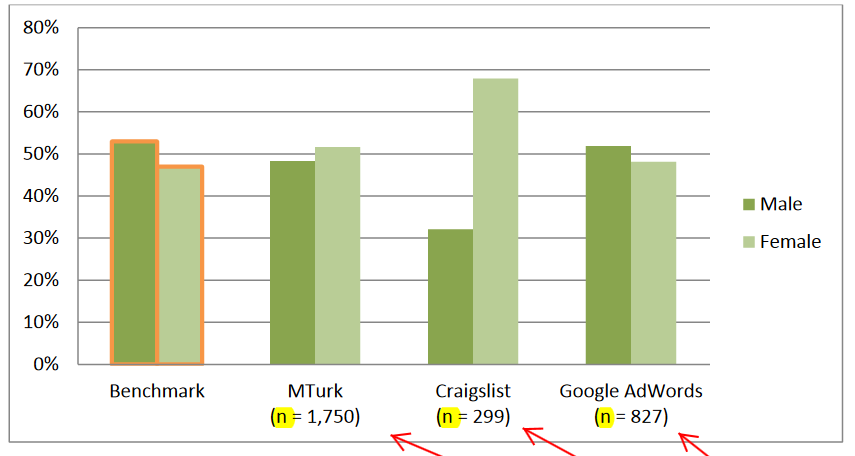
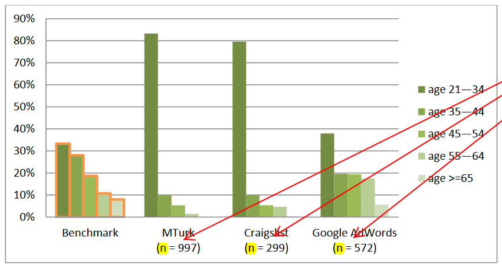
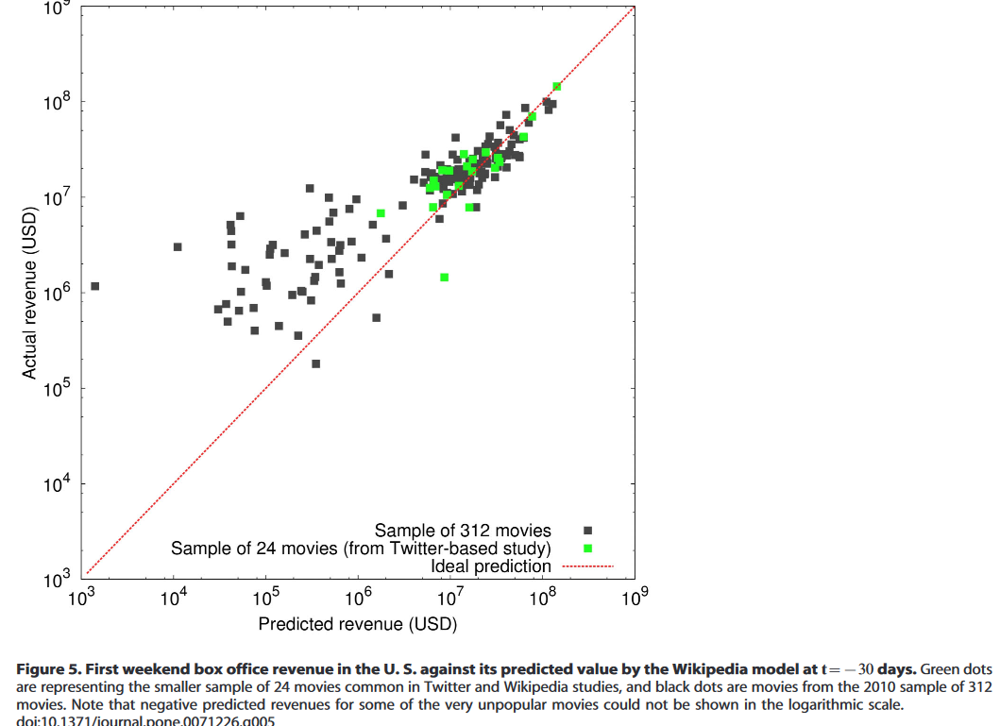
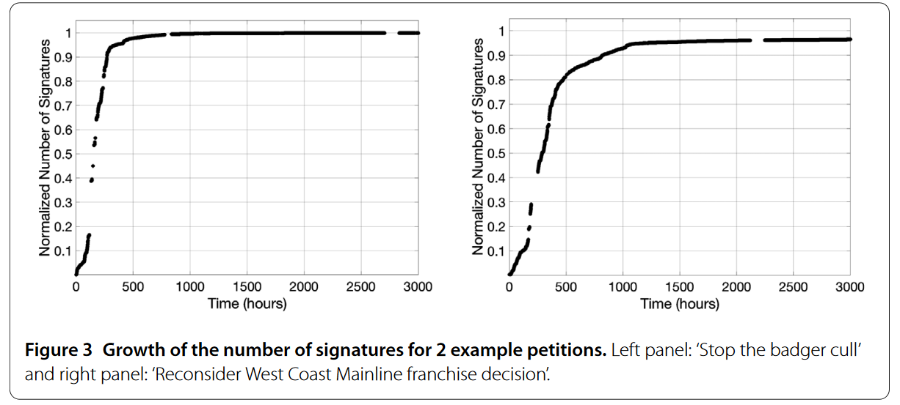
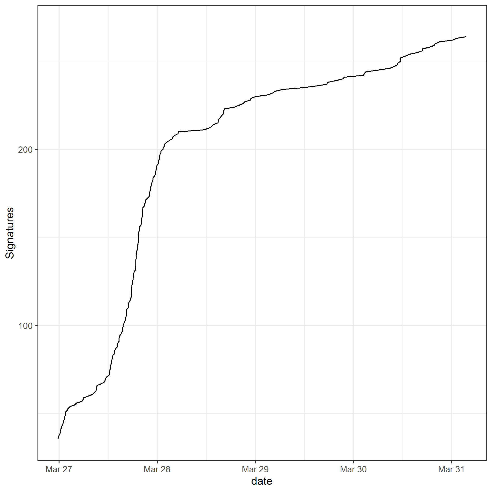
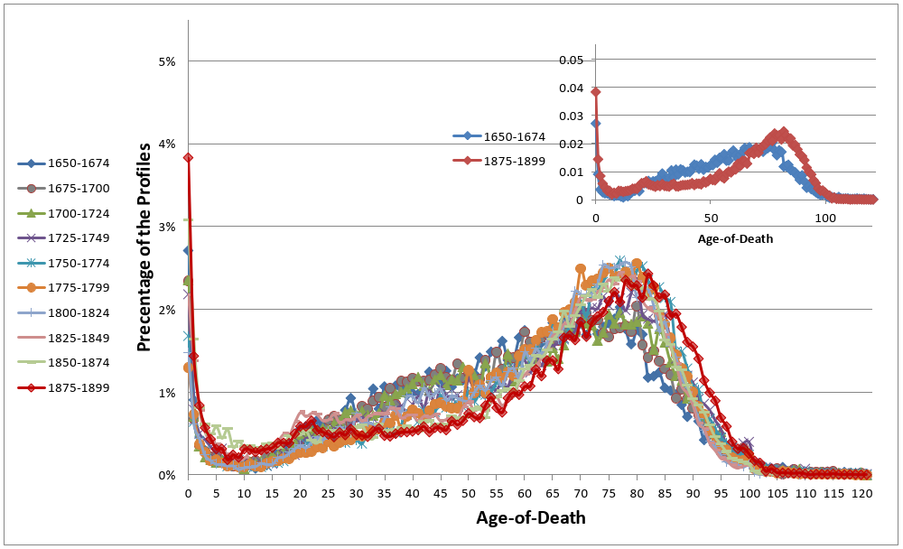

## Agenda

1. Q&A
1. Crowd-sourced data
1. User-generated family trees
1. Limitations and bias

## Q&A

- Download the course materials
- Knit an Rmarkdown document
- Review the assignment instructions
- Other?

# Crowd-sourced data

## What is crowd-sourced data?

- 'Bottom-up' user-generated content
- Usually large
- Available online - may have been produced offline
- By-product of decentralized activity

## Examples in this session

1. Recruitment platforms
1. Online activism in the UK
1. Knowledge building in Wikipedia
1. Family history research

## The issue of representation

{width=350px}

## Crowd-sourcing as recruitment

**Aim**: Strategies for recruiting iPhone users to participate in a web survey through Craigslist, Google AdWords, Facebook, and Amazon Mechanical Turk.


- Pull-method (cash-based platforms): recruits were more cost efficient and committed to the survey task
- Push method (ad-recruitment): recruits were more demographically diverse

\tiny Antoun, C., Zhang, C., Conrad, F.G., and Schober, M.F. (2016). Comparisons of online recruitment strategies for convenience samples: Craigslist, Google AdWords, Facebook, and Amazon Mechanical Turk. Field Methods 28(3):231–246.

## Question time!

{width=40px}

1. Which challenges do you foresee when crowd-sourcing data?

## Question time!

{width=40px}

1. How can crowd-sourcing systematically bias the data collection?

## Question time!

{width=40px}

1. How can crowd-sourcing systematically bias the data collection?
1. What are the privacy considerations?


## Some magic sampling...

{width=30px}

```{r}
n <- c("Anna", "Lara", "Ilgi", "Octavio", "Qi", "Luca"
       , "Miguel", "Madalina", "Margherita", "Niall"
       , "Momoko", "Alexander", "Rustam", 
       "Serena", "Daniel", "Andres", "Heiner")

set.seed(42)
who <- sample(n, 3, replace = F)
n <- n[!n %in% who]
print(who)

```

## Crowd-sourcing as recruitment: representativeness

{width=350px}

\tiny Antoun, C., Zhang, C., Conrad, F.G., and Schober, M.F. (2016). Comparisons of online recruitment strategies for convenience samples: Craigslist, Google AdWords, Facebook, and Amazon Mechanical Turk. Field Methods 28(3):231–246.


## Crowd-sourcing as recruitment: representativeness

{width=350px}

\tiny Antoun, C., Zhang, C., Conrad, F.G., and Schober, M.F. (2016). Comparisons of online recruitment strategies for convenience samples: Craigslist, Google AdWords, Facebook, and Amazon Mechanical Turk. Field Methods 28(3):231–246.

## An example closer to home

{width=350px}

Visit and like: https://www.facebook.com/Health-Behavior-Survey-106662670948465/!

## A different strategy: post-stratification

{width=400px}

\tiny Wang, Rothschild, Goel, and Gelman 2015. Forecasting elections with non-representative polls. International Journal of Forecasting, 31 (3).

## Forecasting with non-representative polls

{width=400px}

\tiny Wang, Rothschild, Goel, and Gelman 2015. Forecasting elections with non-representative polls. International Journal of Forecasting, 31 (3).

## Extrapolating from Wikipedia

{width=350px}

\tiny Mestyán, M., Yasseri, T., and Kertész, J. (2013). Early Prediction of Movie Box Office Success Based on Wikipedia Activity Big Data. PLoS ONE 8(8):e71226.

## A healthy dose of skepticism

> It’s Difficult to Make Predictions, Especially About the Future

## Understand crowd-source directed behaviour

{width=350px}

\tiny Yasseri, T., Hale, S.A., and Margetts, H.Z. (2017). Rapid rise and decay in petition signing. EPJ Data Science 6(1):20.

## Petition to improve coverage of Covid-19 tests in LATAM

{width=300px}

## Question time!

{width=40px}

Think about a way in which you could use crowd-sourcing in your own research.

1. Which platform would you use?
1. Which challenges do you foresee?
1. Special measures to protect privacy?

## Some magic sampling...

{width=30px}

```{r}

who <- sample(n, 3, replace = F)
n <- n[!n %in% who]
print(who)

```

# Online genealogies

## A genealogy is the history of a population

{width=350px}

## WikiTree

{width=250px}

\tiny Fire, M. and Elovici, Y. (2015). Data mining of online genealogy datasets for revealing lifespan patterns in human population. ACM Trans. Intell. Syst. Technol. 6(2):28:1–28:22.

## Demographic measures from online genealogies

{width=350px}

\tiny Fire, M. and Elovici, Y. (2015). Data mining of online genealogy datasets for revealing lifespan patterns in human population. ACM Trans. Intell. Syst. Technol. 6(2):28:1–28:22.

## Demographic measures from online genealogies

{width=350px}

\tiny Fire, M. and Elovici, Y. (2015). Data mining of online genealogy datasets for revealing lifespan patterns in human population. ACM Trans. Intell. Syst. Technol. 6(2):28:1–28:22.

## Geni.com: a social network for genealogists

{width=350px}

## Built on top of (private) genomic data

{width=350px}

## Our example: Familinx data

1. Genealogy-driven social media data
1. Goal: register entire population of the world
1. 86M unique profiles over last 400 years
1. Curated, with quality checks
1. Geo-coded events - 55% Europe; 30% North America

\tiny Kaplanis, J., et al. (2018). Quantitative analysis of population-scale family trees with millions of relatives. Science 360(6385):171–175.

## Geographic distribution in Familinx

{width=350px}

\tiny Diego Alburez-Gutierrez (2020)

## Population alive by age group (all countries)

{width=350px}

\tiny Diego Alburez-Gutierrez (2020)

## Male bias in online genealogies (Familinx)

{width=350px}

## Question time!

{width=40px}

1. Why are there so many men?
1. Can we fix this?
1. What data would we need?

## Some magic sampling...

{width=30px}

```{r}

who <- sample(n, 3, replace = F)
n <- n[!n %in% who]
print(who)

```

## The data generating process

{width=350px}

\tiny Diego Alburez-Gutierrez (2020)

## A closer look at the data generating process

{width=300px}

\tiny https://blog.myheritage.com/2019/09/myheritage-live-2019-recap/

## The Swedish sample

{width=250px}

\tiny Diego Alburez-Gutierrez and Samin Aref (2020)

## Exploring Familinx

``` {r, include = T, warning = F, message = F}

library(data.table); library(tidyverse); library(knitr)

# Read sample Familinx data using data.table
fread("../../Assignment/Data/sweden_genealogy.csv") %>% 
  # To get a sense of the structure of the data:
  select(profileid, father, mother, birth_year, death_year) %>% 
  slice(1:4) %>% 
  kable()

```

## Geographic distribution in our sample

{width=250px}

\tiny Diego Alburez-Gutierrez (2020)

## Correcting bias: an example using post-stratification weights

**Starting point**:
Online genealogies are a non-representative sample of real-world genealogies.

- Online genealogies $\neq$ offline genealogies
- Unknown `weights' - derive from comparison to trusted sources 
- Understand data-generating process
  
\tiny Wang, W., Rothschild, D., Goel, S., and Gelman, A. (2015). Forecasting elections with
non-representative polls. International Journal of Forecasting, 31(3), 980-991.

## Enumerator - death events

{width=350px}

\tiny Diego Alburez-Gutierrez and Emanuele del Fava (2020)

## Denominator or exposure

{width=350px}

\tiny Diego Alburez-Gutierrez and Emanuele del Fava (2020)


## 'Corrected' demographic rates (Sweden)

{width=350px}

\tiny Diego Alburez-Gutierrez and Emanuele del Fava (2020)

## Suggested homework

- Read Sofia Gil’s tutorial on using the FB Marketing API: https://github.com/SofiaG1l/Using_Facebook_API
- Explore website: https://www.digitalgendergaps.org/data/?report=2020-03-02
- Start working on `Exercise 1` from the final assignment 
