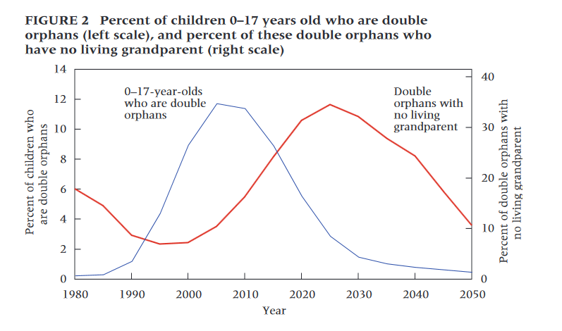
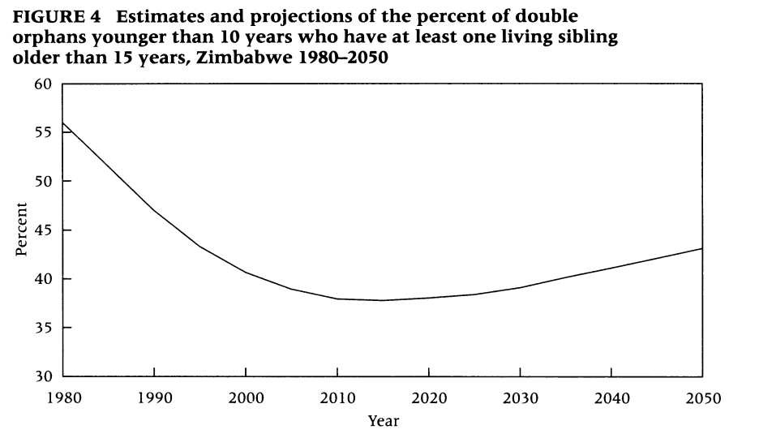
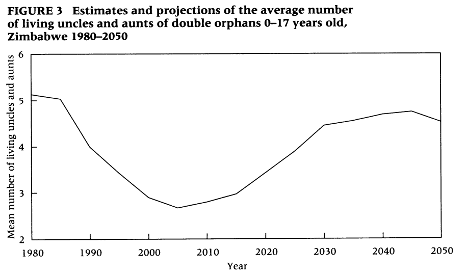
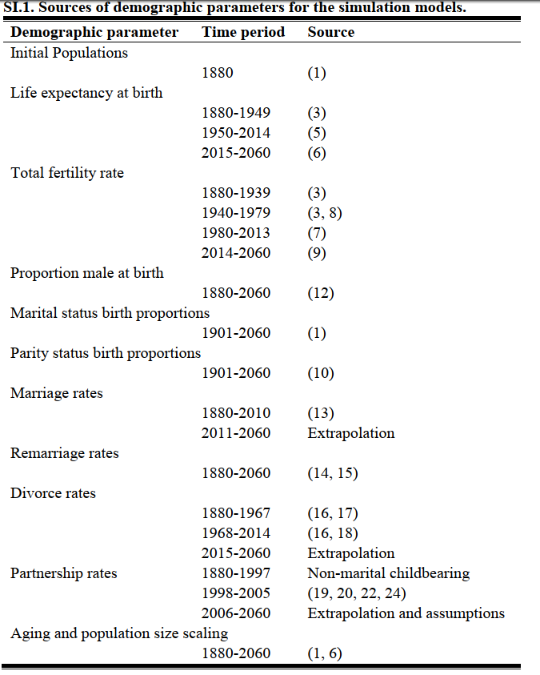
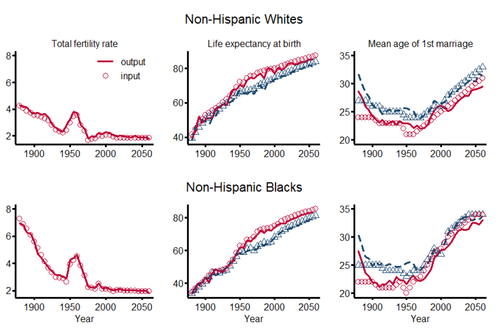
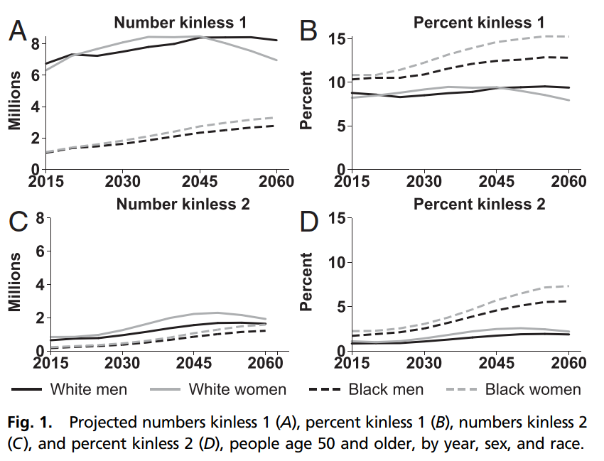
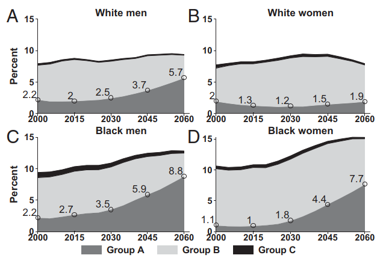

```{r setup, include=FALSE}
knitr::opts_chunk$set(echo = FALSE)
library(tidyverse); library(knitr)
```

## Agenda

1. Q&A
1. Demographic micro simulation
1. Example 1: Impact of the HIV/AIDS epidemic on kinship resources
1. Example 2: Projecting older adults without kin
1. Discussion

## Q&A

- Previous days
- Questions about final assignment 
- Other?

## Demographic micro-simulation

- Model individual-level demographic behaviour applying set of rules
- Make up data where unavailable
- Science: compare to independent method
- Different alternatives:
   + SOCSIM
   + CAMSIM
   + NetLogo (Agent-based modelling)
   + R/python


\tiny Grow, A and  Van Bavel, J. 2018. Agent-Based Modeling of Family Formation and Dissolution. In R. Schoen (Ed.), Analytical Family Demography (pp. 125-156). Springer Series on Demographic Methods and Population Analysis, (Vol. 47), Cham: Springer International Publishing. 


## Creating digital populations

- A stochastic micro-simulation platform, 1970s at UC Berkeley
- Starting with an initial population, applies age-specific demographic rates
- Creates kinship structure similar to a full genealogy
- Now maintained at the MPIDR!


\tiny Mason, C. (2016). SOCSIM Oversimplified. UC Berkeley. https://lab.demog.berkeley.edu/socsim/CurrentDocs/socsimOversimplified.pdf

## A SOCSIM micro-simulation of Sweden (1603-2160)

``` {r, include = T, warning = F, message = F, echo=T}

# Read sample Familinx data using data.table
read.csv("../../Assignment/Data/sweden_socsim.csv") %>% 
  slice(1:4) %>% 
  kable()

```

\tiny Zagheni, E. 2017. The Demographic Foundations of the Lived Experience of Kin Death. Working paper.

## Historical and projected demographic processes

{width=300px}

\tiny Zagheni, E. 2017. The Demographic Foundations of the Lived Experience of Kin Death. Working paper.

# Example 1: Impact of the HIV/AIDS epidemic on kinship resources

## Research at a glance

- RQ: estimate and project probabilities of orphanhood and evolution of kinship structure in Zimbabwe in context of HIV/AIDS epidemic (1980-2050)
- Data: SOCSIM, with rates from UN WPP, Demographic and Health Surveys, World Fertility and Marriage Database, UN HIV infection rates
- Findings: 
   + increase in double orphans with no living grandparents
   + shift of responsibilities to aunts and uncles

\tiny{Zagheni, E. 2011. The impact of the HIV/AIDS epidemic on kinship resources for orphans in Zimbabwe, Population and Development Review 74(4), 761-783.}

## Double-orphans and double-orphans without grandparents

{width=350px}

\tiny{Zagheni, E. 2011. The impact of the HIV/AIDS epidemic on kinship resources for orphans in Zimbabwe, Population and Development Review 74(4), 761-783.}

## Percent of double orphans

{width=350px}

\tiny{Zagheni, E. 2011. The impact of the HIV/AIDS epidemic on kinship resources for orphans in Zimbabwe, Population and Development Review 74(4), 761-783.}

## Availability of aunts and uncles

{width=350px}

\tiny{Zagheni, E. 2011. The impact of the HIV/AIDS epidemic on kinship resources for orphans in Zimbabwe, Population and Development Review 74(4), 761-783.}

# Example 2: Projecting older adults without kin

## Research at a glance

- RQ: Examine the changing population of kinless individuals in American society over the coming decades
- Data: Rates from US census, Human Fertility Database, official statistics 
- Findings:  
   + impending increase of kinless older adults, especially amongst Black
   +  Declines in marriage, one-child families, mortality

\tiny Verdery, A.M. and Margolis, R. (2017). Projections of white and black older adults without living kin in the United States, 2015 to 2060. Proceedings of the National Academy of Sciences 114(42):11109–11114.

## Data sources

{width=250px}

## Sanity checks: comparing to ground-truth

{width=350px}

Key rates, historical and projected changes over time and simulated outcomes, 1880-
2060.

\tiny Verdery, A.M. and Margolis, R. (2017). SI Appendix. Projections of white and black older adults without living kin in the United States, 2015 to 2060. Proceedings of the National Academy of Sciences 114(42):11109–11114.

## Kinlesness by gender and ethnicity in the US

{width=350px}

\tiny Verdery, A.M. and Margolis, R. (2017). Projections of white and black older adults without living kin in the United States, 2015 to 2060. Proceedings of the National Academy of Sciences 114(42):11109–11114.

## Beyond description: looking at mechanisms

{width=350px}

\tiny Verdery, A.M. and Margolis, R. (2017). Projections of white and black older adults without living kin in the United States, 2015 to 2060. Proceedings of the National Academy of Sciences 114(42):11109–11114.


# Discussion

## Strengths and weaknesses of simulated data

- Impact of the HIV/AIDS epidemic
   + Pro: No alternative data source
   + Pro: accounts for clustering of mortality
   + Con: comparison to ground-truth?
   + Con: high uncertainty of projected rates used as input in this context
  

- Projecting older adults without kin
   + Pro: Projection based on real rates
   + Pro: unpacks demographic dynamics leading to outcome
   + Con: model assumptions about marriage market
   + Con: comparison to ground-truth?
   + Con: does not account for future mortality shocks

## When should we use real and simulated populations?

- Use real data whenever possible
- Improve the interval validity of simulations
   + Calibration
   + Methodological triangulation
   + Comparing simulations to ground-truth
   

## A quick example of such a comparison

- Cumulative number of child deaths for a woman surviving to a given age
   + Estimate from SOCISM-generated genealogy
   + Estimate formally:

\begin{equation}
\underbrace{CD_{(a,c, p)}}_{\text{Child deaths}}= \underbrace{\sum_{x=15}^{x=a} {_1F_{(x,c,p)}}}_{\text{Children born}}-\underbrace{\sum_{x=15}^{x=a} {_1F_{(x,c,p)}} l_{(a-x,c+x,p)}}_{\text{Children surviving or } CS_{(a,c,p)} }
\end{equation}

## Ethological triangulation: model and formal estimates

{width=350px}

## More validation: Compare to 'gold-standard' data

{width=350px}

## Another example: sandwichness

- 'Sandwiched' between having a young child and a parent close to death
- Double care responsibility
- Change over time

\begin{equation*}
S(a,c) = \underbrace{  (1 -  \prod_{x=1}^{5} 1 - F_{a-x,c} )      }_{\substack{   \text{Prob. of having given}\\ \text{birth in 5 preceding years}}   } \times \underbrace{M_{a, c}}_{\substack{\text{P. mother}\\ \text{is alive}}} \times  \underbrace{(1-  \frac{M_{a+5, c}}{M_{a, c}})}_{\substack{\text{Prob. that mother}\\ \text{dies within 5 years}}} 
\end{equation*}

## Comparing model and simulated estimates

{width=350px}

## Wrapping up

- How does this relate to your interests?
- Final thoughts?
- Project ideas?